ApiChain is a documentation generation and API automation testing software based on version iteration and project perspectives. It completes the process from creating iterations across several projects, performing API calls on interfaces involved in iterations, generating API documentation for these interfaces and sharing it, to writing automatically executable test cases for the interfaces within iterations. When code is merged and launched after an iteration, ApiChain merges the interfaces and automated test cases of the iteration into the project and conducts comprehensive regression testing. Compared with tools like Postman, ApiChain understands your needs better.

Features of ApiChain include:

1. **API Testing**: Supports sending network requests with URI path parameters and JSON payloads. The data submitted can come from global, project, or iteration environment variables, and supports generating various types of non-repeating random data through built-in functions, such as UUIDs, current time, unique emails, etc. It also retrieves header, cookie, and other information returned by interface requests, allowing for comprehensive iteration and automated interface testing based on this data.
2. **Documentation Export**: Iteration documents can be exported in HTML and Markdown formats or shared in real-time via intranet links.
3. **Automated Testing with Chain Calls**: Interfaces involved in projects and iterations are tested using chained calls. Starting from fixed values, environment variables, or randomly generated data by built-in functions, each step uses the returned JSON, headers, cookies, and previous step's data as input for the next call, creating infinitely repeatable test cases that assert whether each step meets expected outcomes.
4. **Automatic Construction of Data**: Automated testing supports automatic construction of string type data converted from JSON.
5. **Execution Control Between Test Steps**: Users can choose to manually execute the next step, wait for a fixed period before automatically executing the next step, or sequentially execute multiple test cases for projects and iterations to perform regression testing.
6. **Intranet Usage**: Operates entirely within the intranet without requiring internet connection, ensuring high performance and security.

🔥🔥🔥 If you agree that ApiChain understands your needs better, why not [click here to give it a star](https://github.com/jiangliuer326442/ApiChain) and show some support? (*￣︶￣)💋💋💋

## Software Download

v1.2.1:

    1. Support for JsonString Type Parameter Automated Testing
    2. Automated Testing Can Be Multi-Selected for Execution
    3. Automated Testing Supports Execution After Waiting for a Certain Period
    4. Enhanced Import of Interfaces from Postman to ApiChain Projects
    5. Supports Selecting and Copying Environment Variables Between Different Server Environments

Windows platform：[ApiChain_v1.2.1_windows.zip](https://gitee.com/onlinetool/mypostman/releases/download/v1.2.1/ApiChain_v1.2.1_windows.zip)

Linux platform：[ApiChain_v1.2.1_linux.zip](https://gitcode.com/fanghailiang2016/apichain/releases/download/v1.2.1/ApiChain_v1.2.1_linux.zip)

Mac platform：[ApiChain_v1.2.1_macos.zip](https://gitcode.com/fanghailiang2016/apichain/releases/download/v1.2.1/ApiChain_v1.2.1_macos.zip)

If you can't open an application on your Mac, run `sudo spctl --master-disable` in the terminal and it should open normally.

## Introduction

* In the course of version iteration, we manage our interfaces on a project-by-project and folder-by-folder basis, and generate corresponding interface documentation.

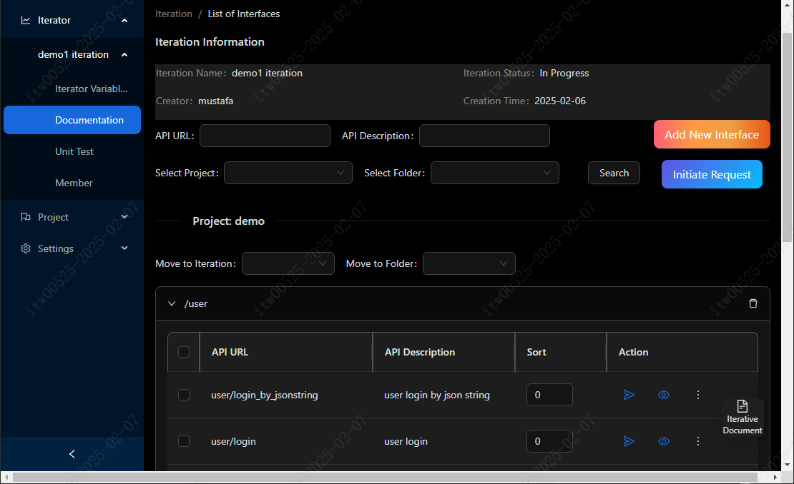


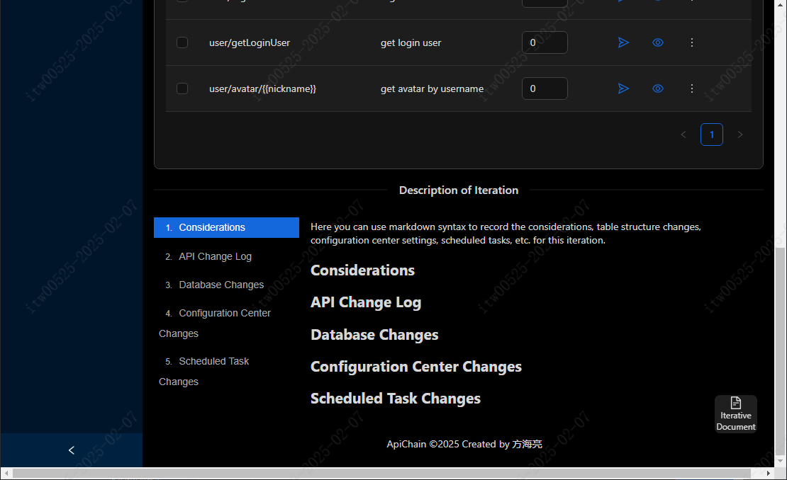

- Send a network request

  Enable the sending of network requests, supporting path variables. You can use variables from iterations, global, and project-scope environments, as well as randomly generated, non-repeating data from built-in functions for data. The returned data includes cookie and header information. It also features the ability to track 302 redirects, capturing comprehensive header and cookie information from the entire chain of redirect paths.

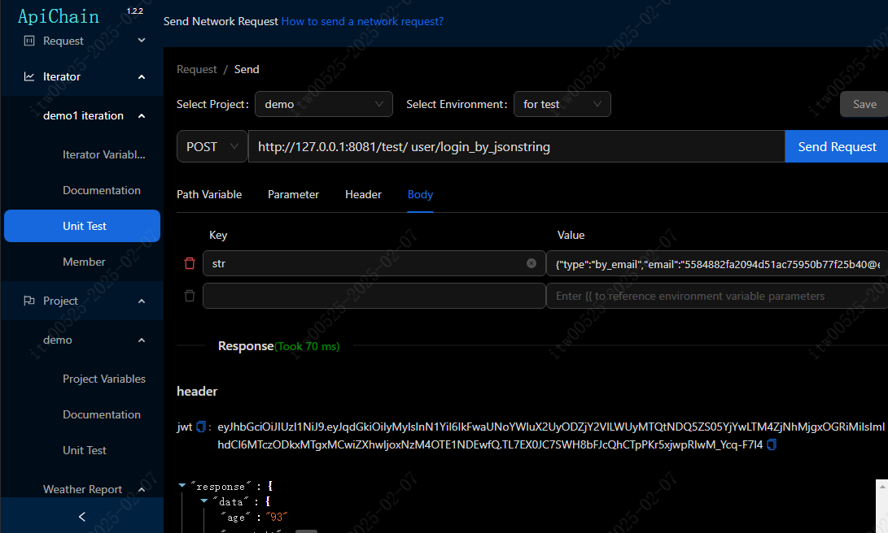

* Interface Details Page

  You have the ability to view various details concerning our interfaces. This includes the parameters input into the interface, examples of what is returned, explanations of the interface itself, and definitions for each field. Additionally, it encompasses documentation for supplementary information such as headers and cookies that are returned.

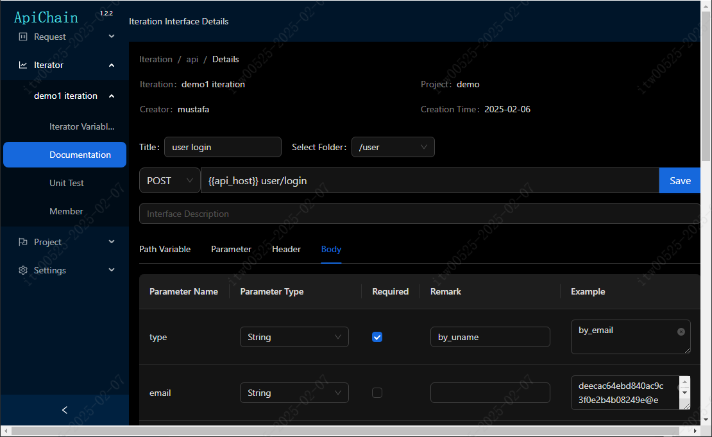

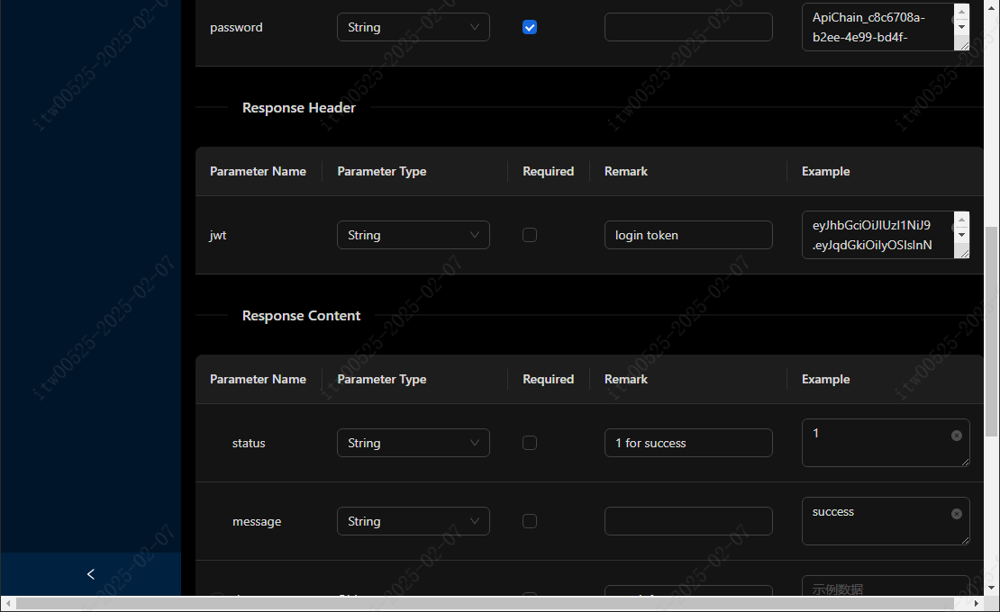

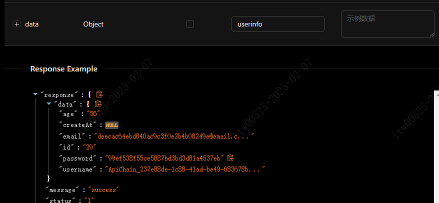

* Interface Documentation Page

  Interface documentation is created for each iteration. This documentation provides a space to add notes and reminders specific to that iteration. It can be easily shared by exporting the document, or by directly sharing the webpage via a browser.

  Mock Server: In the local development phase for the frontend, developers do not need to invoke the interfaces from the test environment. Instead, they can call the interfaces available through the URL of the interface documentation. This will return the mock data that has been pre-configured in the documentation. This mock data can then be used to design and develop the interface, eliminating the need to rely on live data from the test environment during this phase.

  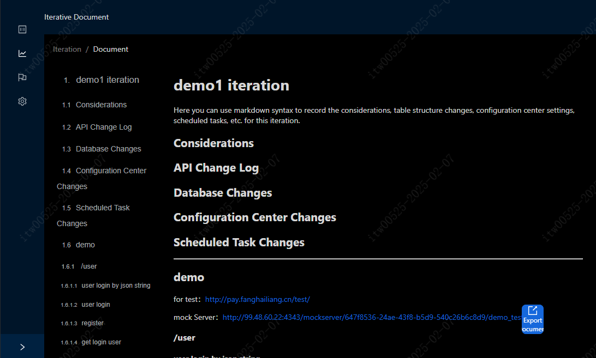

  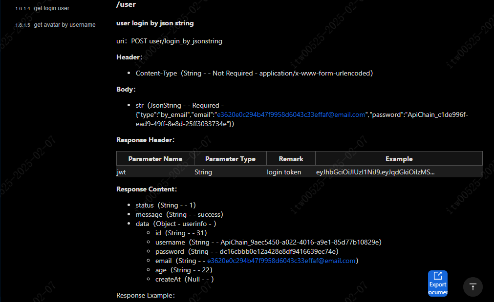

  

* Iteration and Project Unit Test Page

  Chaining together the input parameters and return data from a series of interfaces involved in this iteration forms a test case for these iteration interfaces. These sequences of steps can be automatically executed in order, or they can be paused at any particular step, awaiting a manual click of the 'continue' button for execution to resume.

  Should any test case fail during its execution, you can click on the request URL to jump directly to the page for sending requests. From there, you can re-send the single test request, which can help you to reproduce and debug any bugs that may have occurred.

  You have the option to select multiple test cases for sequential execution, providing you with the capability to perform regression testing for both the iteration and the entire project.

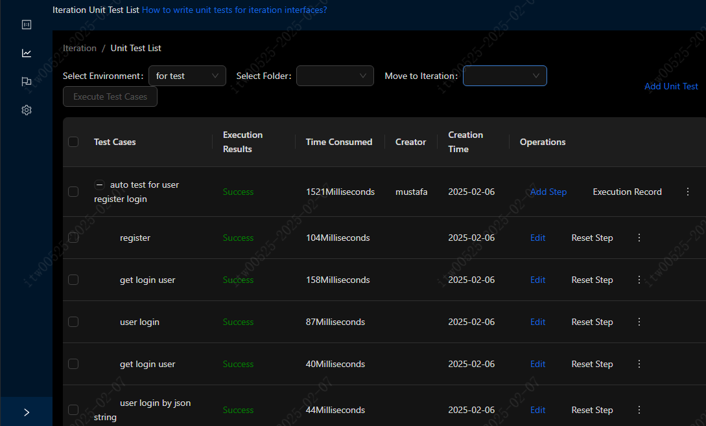

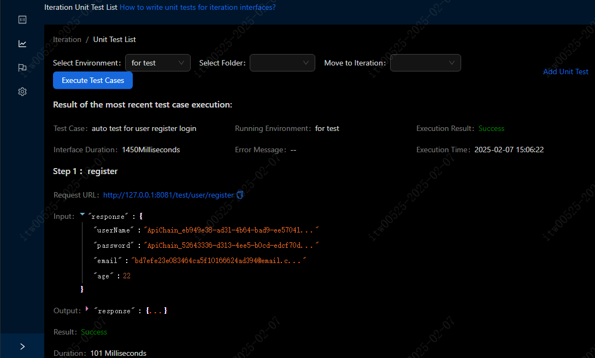

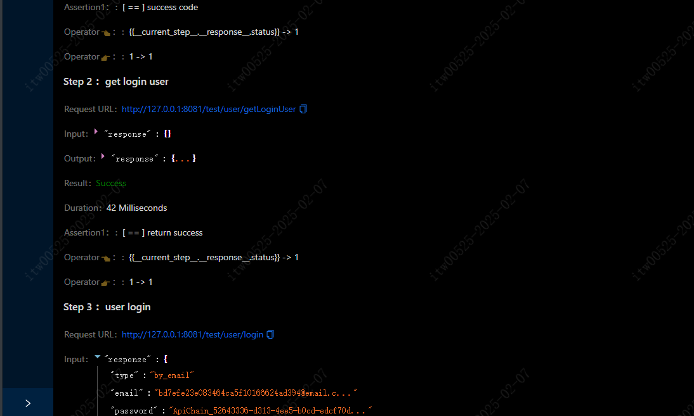

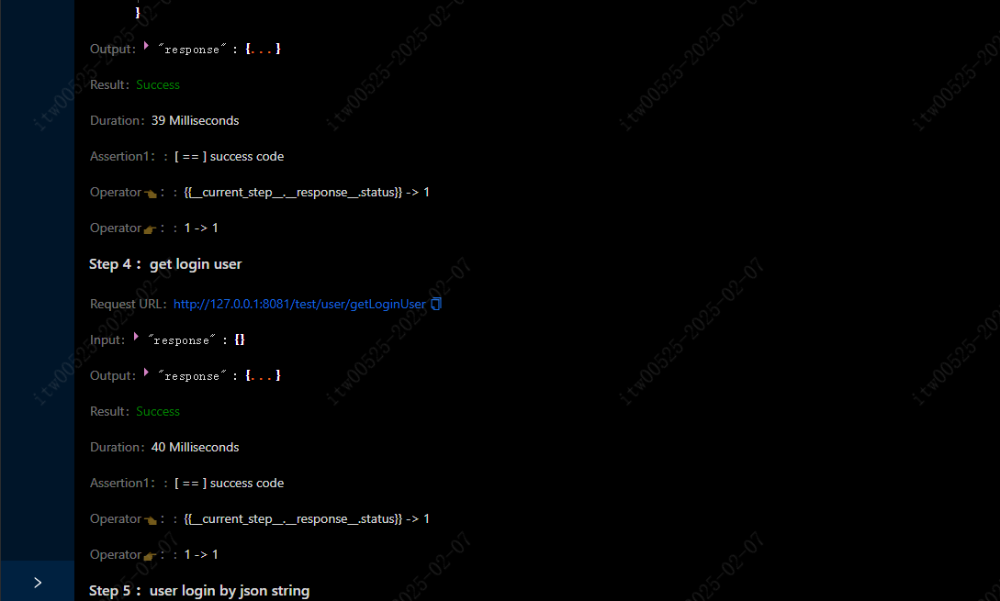

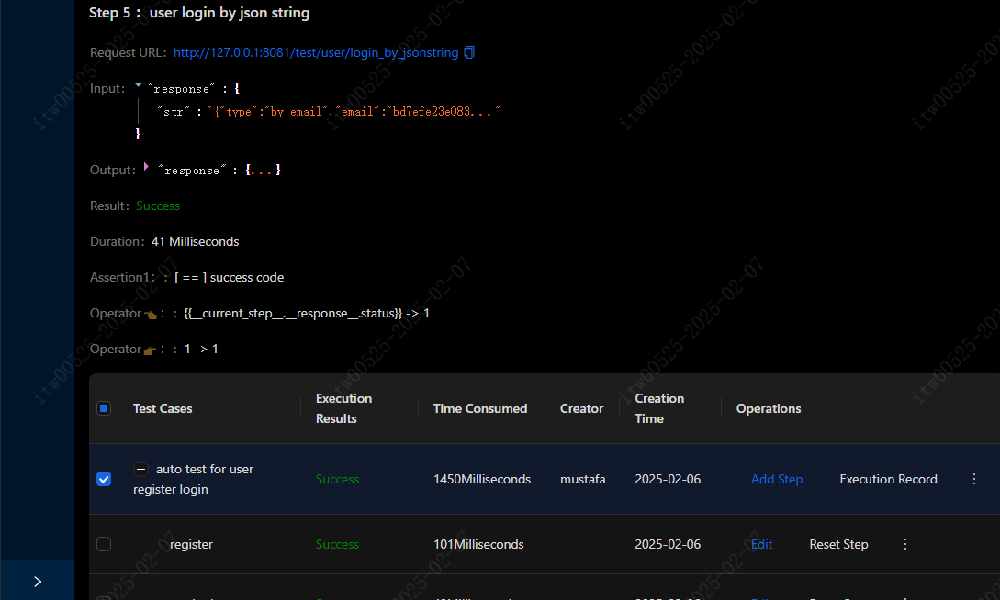

* Filling in unit test parameters

  We iteratively write unit test parameters and assertions to support a large number of common scenario inputs, such as data that triggers previous steps, reading project environment variable data, etc. Variables support random strings (uuid), random integers, current time, and even custom data processing logic using the **eval** function. The unit tests designed in this way, as long as the interface remains unchanged, can be executed repeatedly in the future without modification. They are used for iterative testing as well as project regression testing.

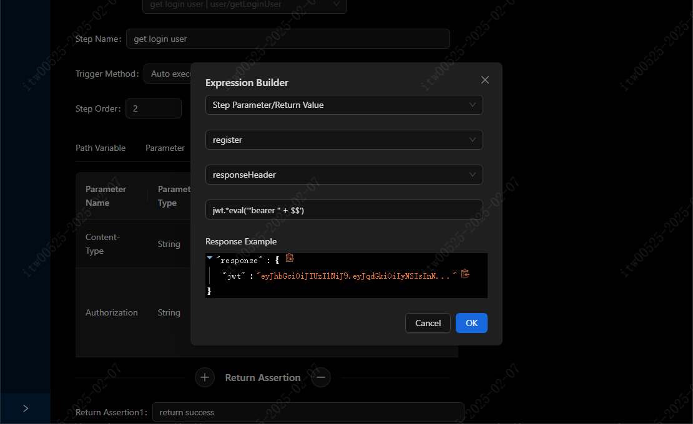

- Project Interface Management & Unit Test List Page

  When an iteration is closed, all interfaces involved in this iteration of all projects will be merged into their corresponding projects. You can view all the interface names, meanings, fields, and return value descriptions of this project by clicking on it. You can also retain the unit test cases that you consider worthy of regression testing from this iteration in the relevant projects, which can be used for regression testing of the projects.

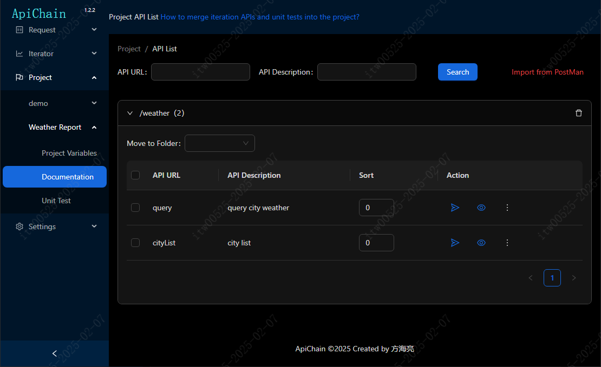

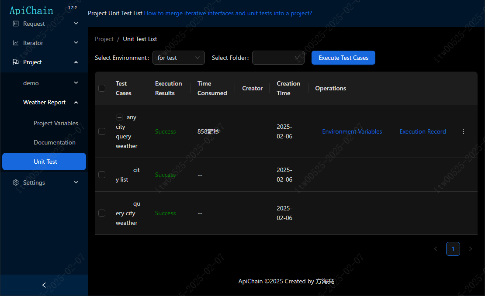

Each unit test case in the project can have its own set of environment variables. These environment variables serve as shared data for a series of steps in this unit test.

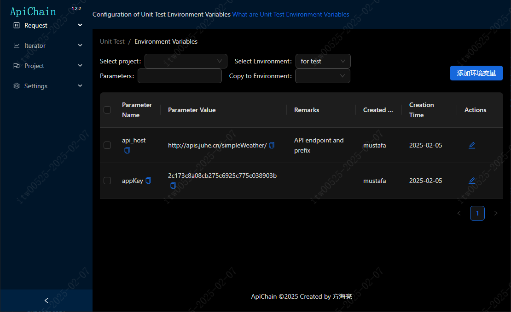

## Relevant Terminologies

- **Development Environment**  

  Normally, our development environments include local (local), development (dev), system integration test (sit), user acceptance test (uat), pre-release (pre), and production (pro) environments. Typically, data in different development environments is isolated. The development environment serves as the container for our **environment variables**.

- **Project**  

  Usually, a specific business is realized through the mutual invocation of different microservices internally, providing a single external entry point. These microservices are referred to as projects. Of course, single-machine projects consisting of just one microservice are also supported.

- **Iteration**  

  Within a certain period, the functional goals that need to be accomplished in the business are called an iteration. For example, implementing a voice room. This involves developing interfaces for various projects, including live streaming, instant messaging (IM), gifts, and game microservices. Therefore, an iteration is a combination of different projects within a certain period.
  
- **Environment Variables**  

  Environment variables are a set of key-value formatted data provided for a specific development environment, allowing us to conveniently modify data, making these somewhat common data more reusable.  Environment variables can be categorized into:    
  
  - Global Environment Variables:Visible to all projects in a specific environment, such as a specific User ID for testing.    
  
  - Project Environment Variables: Data visible only in a specific project, such as the API address (api_host).    
  - Iteration Environment Variables: Data that is only usable for the current version iteration of developing specific features, such as a temporary high-privilege account for verifying specific features. This data should be destroyed upon completion of iteration testing to avoid polluting the global data set.    

  - Unit Test Environment Variables: Data sources used to run through unit tests in a specific environment, effective for this unit test process in the long term.

- **Unit Test**  

  It is a set of interface combinations and judgments on the success of interface return information, realized through continuous, chained network requests to implement and verify a specific function without depending on the user interface.    
  For example, the process of creating a folder, creating a file, writing data, deleting the file, and deleting the folder. The success of adding or deleting a file is verified by checking if the newly created file is in the file list.    
  
  To make unit tests reusable, without modifying data for each execution, unit tests should support the **random string** feature, using random strings as the initial data for unit tests. Simultaneously, there should be a capability to take the input data from any previous step, and compare it with the output data from the current step's execution result, to confirm if the current step is executed correctly.

## Start the journey

Don't know how to use it? Learn by following the examples slowly.

#### Download and import our sample demo data

- Click [here](http://cdn.fanghailiang.cn/demo_database_en.json) to download the sample database.
- Click on the top menu - Data - Restore Database, and select the downloaded sample database file.
- Click on the top menu - Page - Refresh Current Page, and you will be able to see the imported sample data, including sample environments, projects, interfaces, unit tests, etc. Learn about their configuration and usage by viewing, editing, and sending network requests!

The sample database contains two examples; one demonstrates the basic use of ApiChain, while the other includes advanced usage of ApiChain. You can follow the tutorial step by step to learn and get familiar with using this software during the learning process. Here are the links to the detailed operation procedures for these two examples.

[Beginner Tutorial 1: Query the Weather Forecast for Any City - Basic Usage of ApiChain](https://github.com/jiangliuer326442/ApiChain/wikis/入门教程1：用任意城市查询天气预报-ApiChain基本使用)

[Beginner Tutorial 2: User Registration, Login, and Authentication - Advanced Usage of ApiChain](https://github.com/jiangliuer326442/ApiChain/wikis/入门教程2：用户注册登录鉴权-ApiChain高阶使用)

#### Import Your API Data from PostMan

Here, it is assumed that you need to import API data from PostMan. First, you need to export the API data from PostMan and then import the API data in ApiChain. The specific steps are as follows:

- Click [here](http://cdn.fanghailiang.cn/demo_postman.json) to download the backup file of PostMan.

- Click on Settings - Projects - Add Microservice, fill in “fly” for the project identifier, and “drone” for the remarks, then click the confirm button to add the project.

- In the left-side project menu, find the "drone" project, click on Project Environment Variables, select the environment as Local Environment, and you will see an environment variable named "api_host". This represents the domain name address of the project's APIs. It serves as the address prefix for all APIs in this project and needs to start with "http://" or "https://" and end with "/". Click the edit button next to it, fill in the parameter value as **http://127.0.0.1:8081/**, and click the confirm button to save.

- Click on the "Documentation" menu in the left-side menu of the current project, where you will see a red "Import from PostMan" button. Click this button and select the PostMan backup file downloaded in the first step.

- After seeing the "PostMan Import Successful" message but not seeing the API data? Don't worry, click on Page - Refresh Current Page at the top, and you will be able to see the data just imported from PostMan.

- Select an API just imported, click the send request button to test the API, and you can see that it is a network request in application/json format.

  For more tutorials, please refer to our [documentation](https://github.com/jiangliuer326442/ApiChain/wikis), which will also be updated with new features after version updates.

## Compilation from Source Code

Version Dependencies:

- nodejs：v20.12.2
- electron：26.2.4

1. Install & Configure yarn

```cmd
npm install -g yarn
yarn config set ELECTRON_MIRROR https://registry.npmmirror.com/-/binary/electron/
yarn config set ELECTRON_BUILDER_BINARIES_MIRROR https://registry.npmmirror.com/-/binary/electron-builder-binaries/
yarn config set registry https://registry.npmmirror.com/
```

2. Download dependencies

```cmd
yarn
```

3. Generate executable files

```cmd
yarn package
```


## Interact with the author

If you have any critical suggestions for the software, you can contact me via **WeChat**. The QR code is as follows:


If you feel that this has helped you, feel free to buy me a meal, the donation QR code is as follows:

