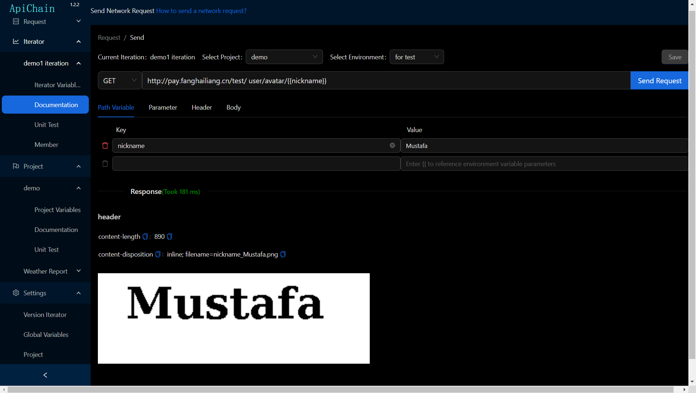

ApiChain is a documentation generation and API automation testing software based on version iteration and project perspectives. It completes the process from creating iterations across several projects, performing API calls on interfaces involved in iterations, generating API documentation for these interfaces and sharing it, to writing automatically executable test cases for the interfaces within iterations. When code is merged and launched after an iteration, ApiChain merges the interfaces and automated test cases of the iteration into the project and conducts comprehensive regression testing. Compared with tools like Postman, ApiChain understands your needs better.

Features of ApiChain include:

1. **API Testing**: Supports sending network requests with URI path parameters and JSON payloads. The data submitted can come from global, project, or iteration environment variables, and supports generating various types of non-repeating random data through built-in functions, such as UUIDs, current time, unique emails, etc. It also retrieves header, cookie, and other information returned by interface requests, allowing for comprehensive iteration and automated interface testing based on this data.
2. **Documentation Export**: Iteration documents can be exported in HTML and Markdown formats or shared in real-time via intranet links.
3. **Automated Testing with Chain Calls**: Interfaces involved in projects and iterations are tested using chained calls. Starting from fixed values, environment variables, or randomly generated data by built-in functions, each step uses the returned JSON, headers, cookies, and previous step's data as input for the next call, creating infinitely repeatable test cases that assert whether each step meets expected outcomes.
4. **Automatic Construction of Data**: Automated testing supports automatic construction of string type data converted from JSON.
5. **Execution Control Between Test Steps**: Users can choose to manually execute the next step, wait for a fixed period before automatically executing the next step, or sequentially execute multiple test cases for projects and iterations to perform regression testing.
6. **Intranet Usage**: Operates entirely within the intranet without requiring internet connection, ensuring high performance and security.

🔥🔥🔥 If you agree that ApiChain understands your needs better, why not [click here to give it a star](https://github.com/jiangliuer326442/ApiChain) and show some support? (*￣︶￣)💋💋💋

### Software Download

v1.2.1:

    1. Support for JsonString Type Parameter Automated Testing
    2. Automated Testing Can Be Multi-Selected for Execution
    3. Automated Testing Supports Execution After Waiting for a Certain Period
    4. Enhanced Import of Interfaces from Postman to ApiChain Projects
    5. Supports Selecting and Copying Environment Variables Between Different Server Environments

windows 平台：[ApiChain_v1.2.1_windows.zip](https://gitee.com/onlinetool/mypostman/releases/download/v1.2.1/ApiChain_v1.2.1_windows.zip)

linux 平台：[ApiChain_v1.2.1_linux.zip](https://gitcode.com/fanghailiang2016/apichain/releases/download/v1.2.1/ApiChain_v1.2.1_linux.zip)

mac 平台：[ApiChain_v1.2.1_macos.zip](https://gitcode.com/fanghailiang2016/apichain/releases/download/v1.2.1/ApiChain_v1.2.1_macos.zip)

mac如果遇到无法打开应用的情况，在终端执行命令`sudo spctl --master-disable` 后即可正常打开。
另外，由于linux和mac平台的包大小超过gitee允许的最大附件大小（100M），故提供外站（gitcode.com）的下载地址。

## 简介

* 在版本迭代中按照项目、文件夹管理我们的接口，并生成接口文档


- 发送网络请求

  发送网络请求，支持路径变量，数据可以使用迭代、全局、项目范围的环境变量，以及内置函数生成的随机不重复数据，返回数据包括了cookie、header信息等，同时能够跟踪302跳转拿到所有跳转路径的全部header、cookie信息。


* 接口详情页

  可以查看我们接口的入参和返回示例、接口说明、字段含义说明等，包括了返回的header、cookie等信息的文档说明。


* 接口文档页

  以迭代为单位，生成接口文档，可以标注一些这个迭代的注意事项，可导出分享，也可直接通过浏览器共享页面。

  mock服务器：前端在本地开发阶段，可以不必调用测试环境接口，而是调用接口文档地址的接口，返回文档中配置的mock数据，以此来画界面。

  

  

  

* 迭代、项目单测页

  把这个迭代涉及的一系列接口入参和返回串联起来调用，就构成了这个迭代接口的一个测试用例。这些一系列的步骤之间可以顺序自动执行，也可以执行到某一步暂停下来，等待你手动按下继续执行的按钮。

  若某个测试用例执行失败，可以点击请求地址跳转到发送请求的页面，可以重复发送单测的请求，用来复现并调试bug。

  可以选择多个测试用例依次执行，进行迭代和整个项目的回归测试。


* 填写单测参数

  我们迭代编写单测入参和断言支持大量常用的情景输入，如引起前面步骤的数据，读取项目环境变量数据等，变量支持随机字符串（uuid）、随机整数、当前时间，甚至使用 **eval** 函数自定义您对数据的处理逻辑。这样设计出来的单测，只要接口未做变更，未来无需修改可反复执行。用于迭代的测试以及项目回归测试。


- 项目接口管理 & 单测列表页

  迭代结束被关闭时候，这个迭代涉及的所有项目的接口会合并到对应的项目中，点击该项目可以查看这个项目所有的接口名称、含义、字段和返回值说明。你也可以把这个迭代认为值得回归测试的单测用例保留到相关的项目中，用于对项目的回归测试。


项目的每个单测用例，都可以有自己的环境变量，这些环境变量属于这个单测一系列步骤的共享数据。


## 相关术语

- 开发环境

  正常情况下，我们的开发环境包括本地local、dev、sit、uat 测试环境、pre 预发布环境、pro 线上环境 等。通常不同开发环境的数据是隔离的，开发环境是我们存放**环境变量**的容器。

- 项目

  通常一个具体的业务会通过内部不同微服务相互调用并对外提供唯一入口，这些微服务称为项目，当然单机项目只有一个微服务也是支持的。

- 迭代

  一个时间段内，业务上需要完成的功能目标称为一个迭代，比如实现一个语音房。涉及到给不同的项目，包括直播、im、礼物、游戏微服务等，开发接口。因此，迭代是一个周期内，不同项目的一个组合。

- 环境变量

  环境变量是 针对特定开发环境提供的 key-value 格式的数据集，可以方便我们修改数据，让这些有一定共性的数据变得更加可复用。

  环境变量分为：

    - 全局环境变量：在特定环境中的所有项目都可见，比如用于测试的特定UID。
    - 项目环境变量：只在特定项目可见的数据，比如接口的api地址（api_host）
    - 迭代环境变量：针对当前开发特定功能的版本迭代才可使用的数据，比如临时申请的验证特定功能的高权限账号，迭代测试完成就要销毁，不便污染全局数据集。
    - 单测环境变量：为了跑通特定环境的单测而使用的数据源，长期对这个单测流程有效。

- 单测
  就是不依赖于用户界面，通过连续的，链式的网络请求 来实现特定功能，并可验证该功能确实实现的一套接口组合以及对接口返回信息的是否成功的判断。
  比如 新建文件夹、创建文件、写入数据、删除文件、删除文件夹这个流程。通过获取文件列表判断新建的文件是否在该文件列表中来验证新增文件或者删除文件是否成功。
  为了让单测变得可复用，不要每次执行单测都要修改数据，单测就要支持 **随机字符串** 这个特性，用随机字符串作为单测的初始数据。同时需要**能够取前面任何一个步骤的输入数据**，与当前步骤执行结果的输出数据进行比较，确认当前步骤是否执行正确

## 开始旅程

不会使用？跟着示例慢慢学

#### 下载并导入我们的示例demo数据

- 点击[这里](http://cdn.fanghailiang.cn/demo_database.json)下载示例数据库

- 点击顶部菜单-数据-还原数据库，选择下载的示例数据库文件

- 点击顶部菜单-页面-刷新当前页面，就可以看到已经导入的示例数据了，包含示例的环境、项目、接口、单侧等，通过查看编辑、发送网络请求等，学习他的配置和使用哦！

  

  示例数据库包含了两个示例，一个演示了 Apichain 的基本使用，另一个包含了 Apichain 的高阶使用，你可以参照教程一步步学习，在学习的过程中熟悉对这款软件的使用。以下是这两个示例的详细操作流程的链接。

  [入门教程1：用任意城市查询天气预报-ApiChain基本使用](https://gitee.com/onlinetool/mypostman/wikis/入门教程1：用任意城市查询天气预报-ApiChain基本使用)

  [入门教程2：用户注册登录鉴权-ApiChain高阶使用](https://gitee.com/onlinetool/mypostman/wikis/入门教程2：用户注册登录鉴权-ApiChain高阶使用)

#### 从PostMan导入您的接口数据

这里假设你需要从PostMan导入接口数据，首先你需要在PostMan中导出接口数据，然后在ApiChain中导入接口数据。具体步骤如下：

- 点击[这里](http://cdn.fanghailiang.cn/demo_postman.json)下载 PostMan 的备份文件。

- 点击设置-项目-添加微服务，项目标识 填写 “fly”，备注填写 “无人机”，确定按钮新增项目。

- 在左侧项目菜单找到“无人机”项目，点击项目环境变量，选择环境，本地环境，可以看到一个名为“api_host”的环境变量，这代表这个项目的接口域名地址。是这个项目所有接口的地址前缀，需要 “http://”或者“https://”开头，“/”结尾。点击旁边的编辑按钮，参数值填写 **http://127.0.0.1:8081/**，点击确定按钮保存。

- 点击当前项目左侧菜单的“文档”菜单，可以看到红色的“从PostMan导入”按钮，点击这个按钮，选择第一步下载的 PostMan 备份为难。

- 看到“导入PostMan成功”的提示，但是没有看到接口数据？别着急，点击顶部的页面-刷新当前页面，就可以看到刚刚从PostMan导入的数据了。

- 选择一个刚刚导入的接口，点击发送请求按钮，就可以测试接口了，可以看到这是一个 application/json 格式的网络请求。

  更多教程请查阅我们的[文档](https://gitee.com/onlinetool/mypostman/wikis)，版本更新后新增功能也会同步更新到该文档中。

## 版本发布记录

v1.0.9:

    1. 启动速度优化
    2. 使用ssh key作为默认用户
    3. 修复bug
    4. 界面滚动条优化

v1.0.8:

    1. 支持将本次迭代部分接口因功能不上线移动到另一个迭代中
    2. 支持选择部分环境变量拷贝到另一个开发环境
    3. 支持将部分项目导出到另一个用户电脑，实现项目接口的共享
    4. 将原有收费功能价格调整为1元

v1.0.7:

    1. 单测链支持引用前面步骤cookie作为入参
    2. 网络请求和单测统计接口耗时
    3. 支持将迭代的单测导出到项目用于项目回归测试

v1.0.6:

    1. 修复历史记录无法使用迭代环境变量的问题

v1.0.5:

    1. 完善发送网络请求和迭代单元测试相关功能，支持从迭代到项目的可复用单元测试

v0.0.5:

    1. 增加VIP充值和mock服务器功能

v0.0.4

    1. 迭代支持接口先行方式添加 api
    2. header 支持 application/json，multipart/form-data 两种方式的 api
    3. 迭代自动化测试支持手动和自动两种触发方式
    4. 其他 bug 修复和界面调整

## 从源码编译

版本依赖：

- nodejs：v20.12.2
- electron：26.2.4

1. 安装 & 配置 yarn

```cmd
npm install -g yarn
yarn config set ELECTRON_MIRROR https://registry.npmmirror.com/-/binary/electron/
yarn config set ELECTRON_BUILDER_BINARIES_MIRROR https://registry.npmmirror.com/-/binary/electron-builder-binaries/
yarn config set registry https://registry.npmmirror.com/
```

2. 下载依赖包

```cmd
yarn
```

3. 生成可执行文件

```cmd
yarn package
```

##

## 与作者交互

您对软件有任何批评建议，可以加我微信沟通，二维码如下：


如果觉得帮到了你，可以不吝打赏一个鸡腿哦，打赏二维码如下：

